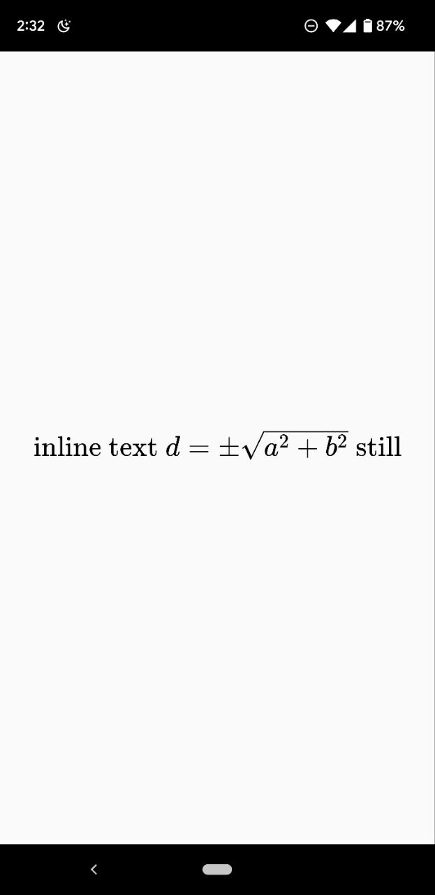

# React Native [](https://katex.org/)

[react-native-webview](https://github.com/react-native-community/react-native-webview) bundled with [KaTeX](https://github.com/Khan/KaTeX)

[![NPM version][npm-image]][npm-url]
[![Downloads][downloads-image]][npm-url]
[![Github CI Status][github-image]][github-url]

## Example

[EXPO Snack][expo-url]

<p align="center">
  
</p>

## Usage
```javascript
const styles = StyleSheet.create({
  katex: {
    flex: 1,
  }
});

const inlineStyle = `
html, body {
  display: flex;
  background-color: #fafafa;
  justify-content: center;
  align-items: center;
  height: 100%;
  margin: 0;
  padding: 0;
}
.katex {
  font-size: 4em;
  margin: 0;
  display: flex;
}
`;

export default function App() {
  const inlineText = 'inline text';
  const [loaded, setLoaded] = useState(false);
  const [expression, setExpression] = useState(`\\text{${inlineText} }c=\\pm\\sqrt{a^2 + b^2}`);
  setTimeout(() => setExpression(`\\text{${inlineText} }d=\\pm\\sqrt{a^2 + b^2}\\text{ still}`), 2000);

  return (
    <Katex
      expression={expression}
      style={styles.katex}
      inlineStyle={inlineStyle}
      displayMode={false}
      throwOnError={false}
      errorColor="#f00"
      macros={{}}
      colorIsTextColor={false}
      onLoad={() => setLoaded(true)}
      onError={() => console.error('Error')}
    />
  );
}
```


## License
License [The MIT License](http://opensource.org/licenses/MIT)
Copyright (c) 2017-2024 Ivan Zakharchanka

[downloads-image]: https://img.shields.io/npm/dm/react-native-katex.svg
[npm-url]: https://www.npmjs.com/package/react-native-katex
[npm-image]: https://img.shields.io/npm/v/react-native-katex.svg

[github-url]: https://github.com/3axap4eHko/react-native-katex/actions/workflows/build.yml
[github-image]: https://github.com/3axap4eHko/react-native-katex/actions/workflows/build.yml/badge.svg

[expo-image]: https://raw.githubusercontent.com/3axap4eHko/react-native-katex/master/screenshot.png
[expo-url]: https://snack.expo.io/@3axap4ehko/react-native-katex
